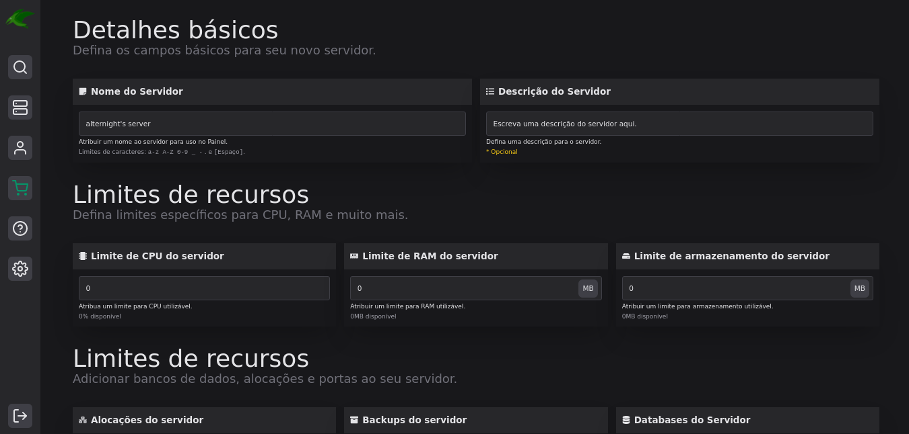
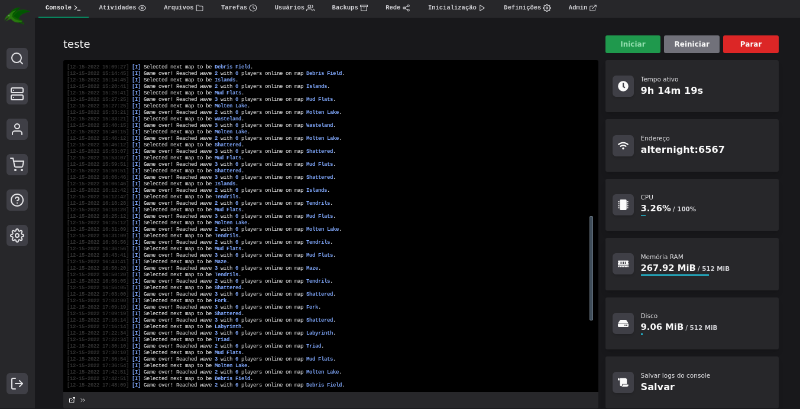
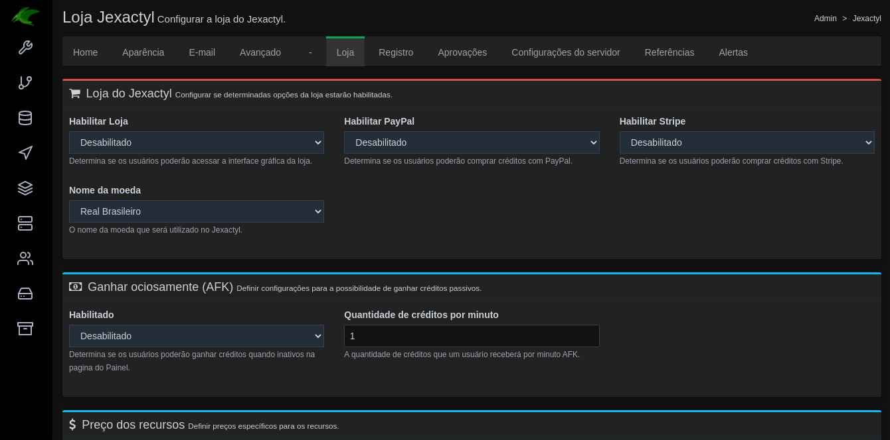

# Bem-vindo ao Jexactyl!

Jexactyl é um painel moderno, rápido e rico em recursos do [Painel Pterodactyl](https://github.com/pterodactyl/panel).
Jexactyl visa melhorar os recursos já existentes deste software, bem como integrar muitas outras funções
para tornar este software mais fácil mais avançado, ao mesmo tempo em que é mais agradável de usar.

## Características
- Construído usando as últimas dependências e pacotes
- Permite que os usuários comprem recursos e criem servidores
- Interface do usuário limpa e minimalista
- Totalmente configurável
- Sistema de Renovação de Servidores

## Pronto para começar?
Se você é um novo usuário, você deve verificar o nosso [Guias de Instalação](https://docs.jexactylbrasil.ml/#/principal/painel/instalação/dependencias).

Se você é um usuário mais experiente que deseja editar o Painel, confira nossa [Guia de Modificação](https://docs.jexactylbrasil.ml/#/principal/build/instalação).

## Screenshots

## Temas do Administrador

